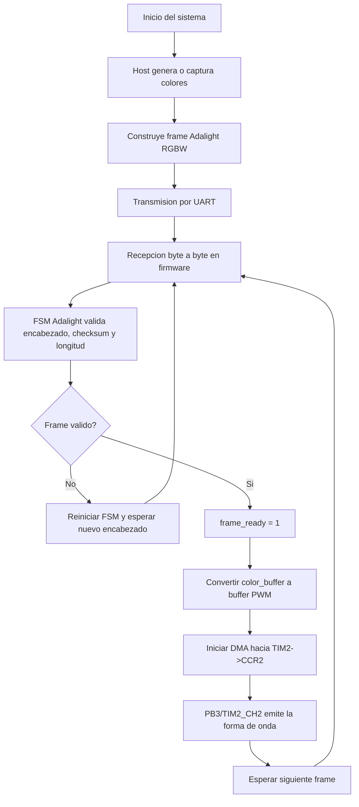
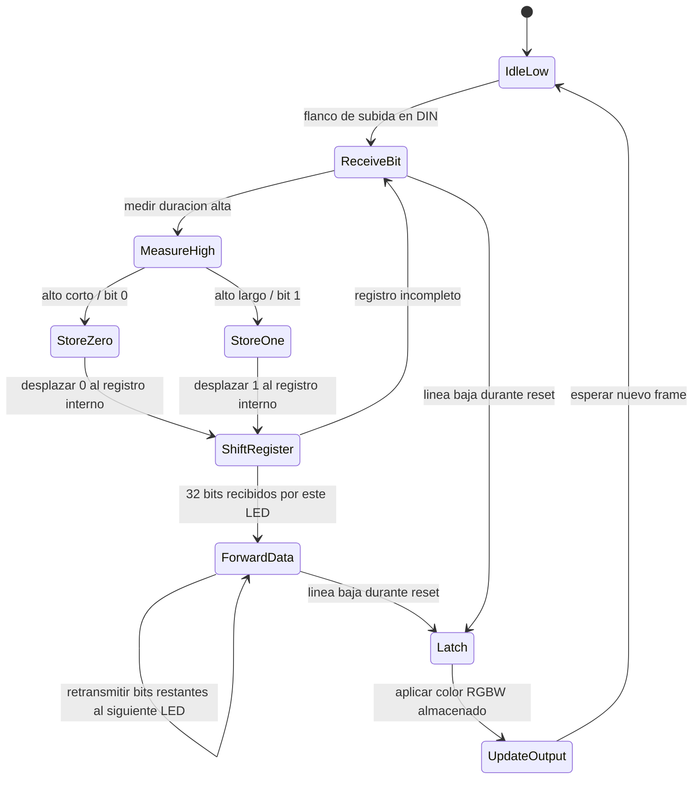
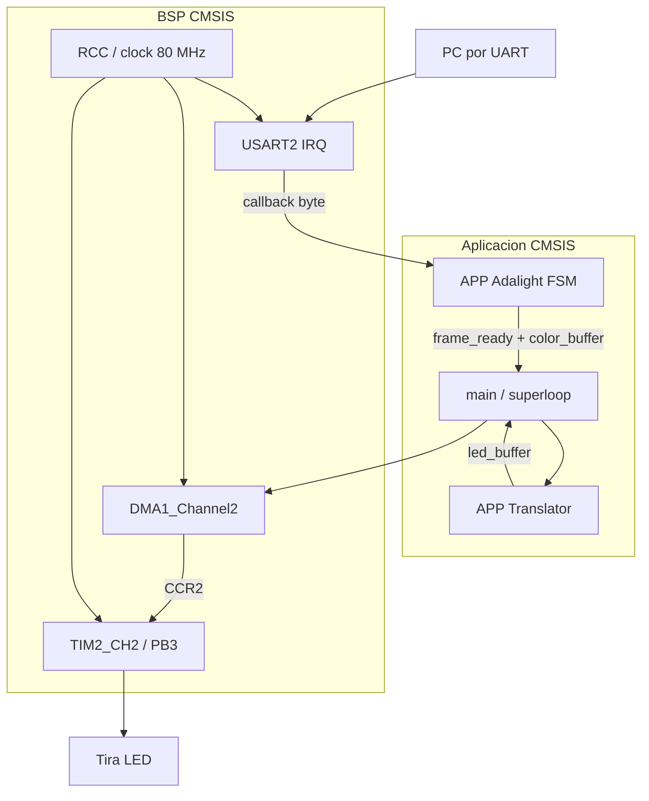
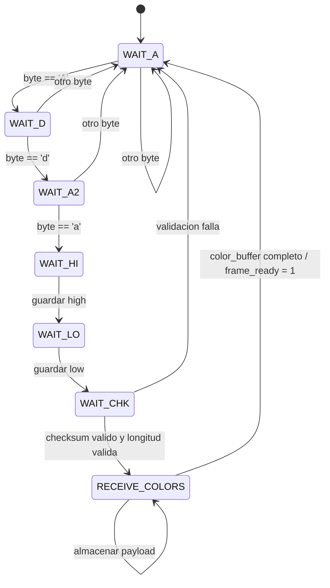
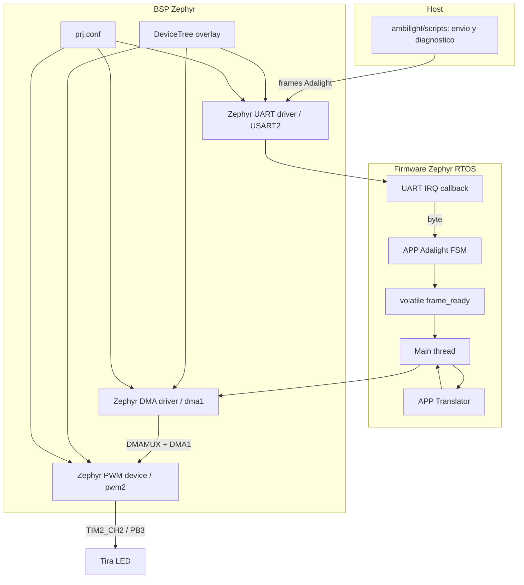
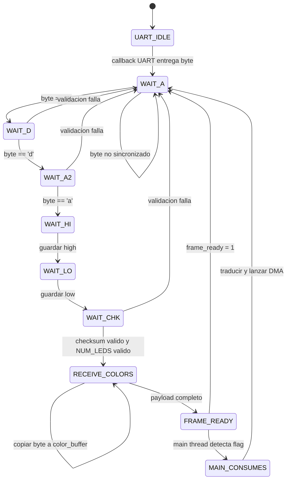
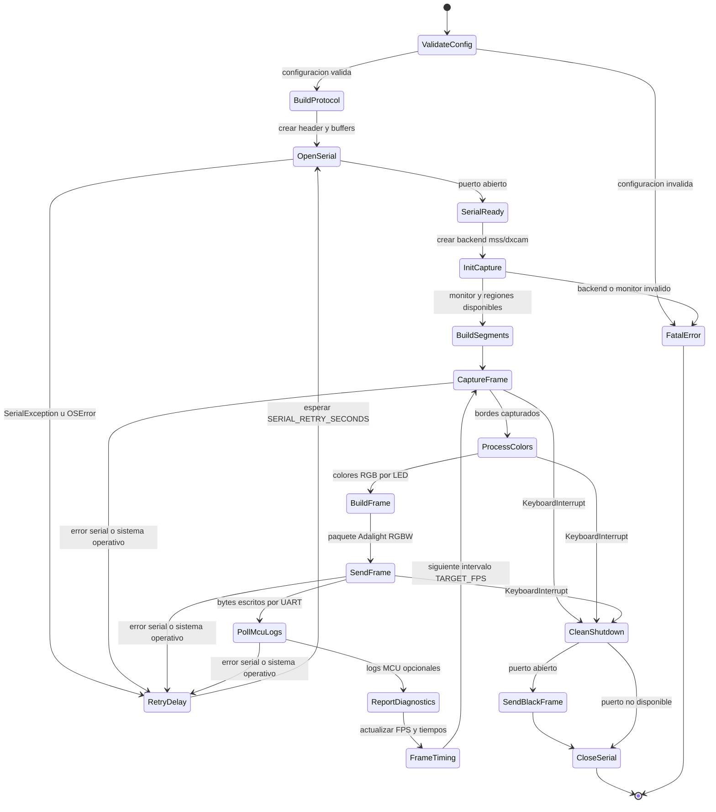

# Documentacion tecnica del proyecto Ambilight

## 1. Introduccion

Este documento describe el proyecto Ambilight como una solucion embebida para controlar una tira LED RGBW desde datos generados en un PC. El sistema completo recibe colores por comunicacion serial, valida tramas compatibles con el protocolo Adalight, convierte los bytes RGBW a muestras PWM y actualiza la salida LED mediante temporizador y DMA.

El proyecto existe en dos implementaciones de firmware:

| Implementacion | MCU objetivo | Enfoque |
|---|---|---|
| CMSIS | STM32L412KB/STM32L432KC | Control directo por registros, interrupciones y superloop. |
| Zephyr RTOS | STM32L432KC | Integracion con drivers Zephyr, DeviceTree, main thread y BSP compatible. |

Ambas implementaciones comparten el mismo contrato funcional: el host envia una trama `Ada`, el firmware la recibe byte a byte, una FSM valida el encabezado y el tamano, el buffer de color se convierte a valores PWM y el DMA alimenta `TIM2->CCR2` para generar la senal sobre PB3/TIM2_CH2.

Valores funcionales comunes:

| Parametro | Valor |
|---|---:|
| LEDs activos | 120 |
| Bytes por LED | 4, formato RGBW |
| Payload de color | 480 bytes |
| Muestras PWM | 3940 muestras, incluyendo zona de reset/latch |
| Encabezado | `Ada + high + low + checksum` |
| Checksum | `high ^ low ^ 0x55` |

## 2. Arquitectura general del sistema

El sistema se divide en dos dominios: el host, que genera o captura colores, y el firmware STM32, que convierte esos datos en una senal fisica para la tira LED.


El firmware no decide el contenido visual de la tira. Su responsabilidad es recibir un frame valido, preservar el orden de bytes, expandir cada bit a un valor PWM y transmitir la forma de onda con temporizacion estable.

### Protocolo de comunicacion

La trama esperada por ambas implementaciones es:

```text
Byte 0: 'A'
Byte 1: 'd'
Byte 2: 'a'
Byte 3: high = (NUM_LEDS - 1) >> 8
Byte 4: low  = (NUM_LEDS - 1) & 0xFF
Byte 5: checksum = high ^ low ^ 0x55
Bytes 6..485: payload RGBW, 480 bytes
```

El firmware valida encabezado, checksum y numero de LEDs. El contenido RGBW no se interpreta semanticamente dentro del firmware; se procesa como una secuencia lineal de bytes.

### Flujo operativo general



### Funcionamiento de la tira SK6812

La SK6812 es una tira LED direccionable. Cada LED contiene un controlador interno que recibe una secuencia serial temporizada por un unico pin de datos, toma los bits que le corresponden y retransmite el resto hacia el siguiente LED de la cadena. En la configuracion RGBW usada por el proyecto, cada LED consume 32 bits: 8 bits para rojo, 8 para verde, 8 para azul y 8 para blanco.

La senal no es UART, SPI ni PWM multicanal tradicional. El firmware genera un tren de pulsos donde cada bit dura aproximadamente 1.25 us. Dentro de ese periodo, la duracion del nivel alto define el valor logico: un pulso alto corto representa `0`, y un pulso alto largo representa `1`. Por eso el timer trabaja a 80 MHz pero la forma de onda resultante se emite a 800 kHz: el reloj rapido se divide en 100 ticks para construir cada bit con suficiente resolucion temporal.

En el firmware, el translator convierte cada bit RGBW en una muestra de duty cycle. Luego el DMA actualiza `TIM2->CCR2` una vez por periodo PWM, y TIM2_CH2 emite la forma de onda fisica por PB3. Al terminar los 3840 bits de los 120 LEDs, el buffer PWM agrega una zona de reset/latch en bajo para que la tira aplique el nuevo frame.



Este comportamiento explica por que el firmware debe preservar el orden exacto de bits y mantener una temporizacion estable. Si el duty de un bit cae en la zona corta, la SK6812 lo interpreta como `0`; si cae en la zona larga, lo interpreta como `1`. La pausa final en bajo no representa un color, sino la condicion de latch que confirma que el frame termino.

## 3. Implementacion CMSIS

### Descripcion general

La implementacion CMSIS es la version original del firmware. Usa acceso directo a registros del STM32L412KB para configurar reloj, UART, temporizador, GPIO y DMA. Su arquitectura es deliberadamente pequena: una BSP inicializa perifericos, la capa de aplicacion procesa el protocolo y `main` coordina el paso de frame completo a salida PWM.

Responsabilidades principales:

| Componente | Responsabilidad |
|---|---|
| `main` | Inicializar BSP, registrar callback UART, vigilar `frame_ready` y disparar conversion/DMA. |
| BSP UART | Configurar USART2, pines de comunicacion e interrupcion de recepcion. |
| BSP PWM/RCC | Configurar reloj del sistema, GPIO PB3 y TIM2_CH2. |
| BSP DMA | Preparar DMA1 para escribir muestras PWM en `TIM2->CCR2`. |
| APP Adalight | Implementar la FSM de recepcion y llenar `color_buffer`. |
| APP Translator | Convertir bytes RGBW en muestras PWM bit a bit. |

### Arquitectura CMSIS



El sistema usa un superloop sin scheduler. La unica asincronia relevante es la interrupcion de USART2, que entrega bytes al parser mediante callback. El resto del procesamiento se ejecuta cuando el superloop detecta `frame_ready`.

### Inicializacion del sistema

El orden de arranque es:

1. Configuracion de reloj y latencia de Flash mediante `rcc_init`.
2. Configuracion de USART2, pines y `USART2_IRQHandler` mediante `uart_init`.
3. Configuracion de PB3 como funcion alternativa TIM2_CH2 mediante `pwm_init`.
4. Configuracion de DMA1 para transferencia memoria-periferico mediante `dma_init`.
5. Registro de `Adalight_ProcessByte` como callback de recepcion UART.

Esta secuencia mantiene separada la inicializacion de perifericos de la logica de aplicacion.

### FSM CMSIS



La FSM permite recuperar sincronizacion descartando tramas incompletas o invalidas hasta encontrar un nuevo encabezado `Ada`.

### Flujo de trabajo CMSIS

1. **Recepcion de datos:** `USART2_IRQHandler` lee el byte recibido y ejecuta el callback registrado.
2. **Procesamiento interno:** `Adalight_ProcessByte` avanza la FSM y copia bytes de color al buffer lineal.
3. **Actualizacion de LEDs:** cuando `frame_ready` se activa, el superloop convierte el buffer RGBW a muestras PWM.
4. **Transferencia fisica:** DMA1 escribe las muestras en `TIM2->CCR2`, actualizando el duty de TIM2_CH2 sobre PB3.
5. **Manejo de errores:** errores de encabezado, checksum o longitud reinician la FSM a `WAIT_A`.
6. **Ciclo principal:** el superloop permanece esperando nuevos frames, sin colas ni multitarea.

### Caracteristicas tecnicas

La implementacion CMSIS minimiza capas de abstraccion y permite control fino de registros. Esto favorece predictibilidad temporal y bajo overhead, pero concentra responsabilidad de seguridad, sincronizacion y mantenimiento en el programador. El disparo de DMA ocurre desde la aplicacion, por lo que el limite entre BSP y logica de coordinacion es menos estricto que en la version Zephyr.

## 4. Implementacion Zephyr RTOS

### Descripcion general

La implementacion Zephyr es una evolucion de la version CMSIS. Mantiene el contrato de aplicacion, el parser Adalight y la traduccion RGBW a PWM, pero mueve la integracion de hardware hacia mecanismos Zephyr: DeviceTree, drivers de UART/PWM/DMA, configuracion `prj.conf` y BSP compatible.

Motivaciones de la migracion:

- Reducir dependencia directa de inicializacion manual de reloj y pinmux.
- Aprovechar drivers y configuracion declarativa de Zephyr.
- Mejorar portabilidad y mantenibilidad de la BSP.
- Facilitar diagnosticos y pruebas por entornos separados.
- Preparar el proyecto para crecimiento futuro con primitivas RTOS si se requieren.

La arquitectura actual no crea threads de aplicacion adicionales. El flujo principal se ejecuta en el main thread de Zephyr; la recepcion UART entra por callback interrupt-driven, y la sincronizacion con el main thread se realiza con `volatile frame_ready`.

### Arquitectura Zephyr



El diagrama muestra la separacion entre aplicacion y BSP. Zephyr aporta el modelo de dispositivo y el soporte de drivers; la logica funcional del protocolo permanece en modulos de aplicacion equivalentes a los del firmware CMSIS.

### Planificacion, sincronizacion y drivers

| Elemento | Uso actual en Zephyr |
|---|---|
| Main thread | Ejecuta inicializacion, superloop operativo, traduccion y disparo DMA. |
| UART callback | Entrega bytes recibidos desde USART2 al parser Adalight. |
| Sincronizacion | `volatile frame_ready`, compartido entre callback y main thread. |
| DeviceTree | Habilita USART2, DMA1, TIM2/PWM2 y pin PB3 como AF1. |
| `prj.conf` | Habilita `CONFIG_SERIAL`, `CONFIG_UART_INTERRUPT_DRIVEN`, `CONFIG_DMA`, `CONFIG_PWM`. |
| PWM | Usa TIM2_CH2 sobre PB3 como salida fisica. |
| DMA | Usa DMA1/DMAMUX para alimentar `TIM2->CCR2` desde el buffer PWM. |

No se documentan colas ni worker threads como parte de la implementacion actual. Zephyr permite agregarlos en una evolucion posterior, pero el estado actual conserva un flujo cercano al superloop original para reducir el riesgo de migracion.

### FSM Zephyr



La FSM de protocolo es equivalente a CMSIS. La diferencia arquitectonica es el origen del byte: en CMSIS viene de `USART2_IRQHandler`; en Zephyr viene del callback registrado sobre el driver UART.

### Flujo de trabajo Zephyr

1. **Captura y recepcion de datos:** herramientas bajo `ambilight/scripts/` generan frames RGBW y los envian por USART2.
2. **Distribucion de tareas:** el driver UART de Zephyr invoca el callback de recepcion; el main thread permanece atento a `frame_ready`.
3. **Procesamiento:** el parser llena `color_buffer`; el translator expande bits a valores PWM.
4. **Actualizacion de LEDs:** la BSP inicia una transferencia DMA hacia `TIM2->CCR2` para modular PB3/TIM2_CH2.
5. **Manejo de errores:** la FSM descarta tramas invalidas; errores de inicializacion o DMA se exponen mediante retornos y diagnosticos temporales.
6. **Ciclo operativo:** el main thread repite el ciclo recibir-frame, traducir, transmitir, esperar nuevo frame.

### Evolucion frente a CMSIS

La version Zephyr conserva la arquitectura funcional para mantener compatibilidad, pero mejora la frontera de abstraccion. La aplicacion ya no necesita escribir directamente en registros DMA para iniciar una transferencia; usa una funcion BSP dedicada. La configuracion de pines y dispositivos tambien queda representada en DeviceTree, lo que hace mas explicita la relacion entre firmware y hardware.

## 5. Scripts y herramientas auxiliares

Los scripts documentados pertenecen al directorio `C:\Users\justa\OneDrive\Documentos\PlatformIO\Projects\ambilight\scripts`. Su funcion es operar desde el host: generar frames Adalight RGBW, enviar datos por UART, leer diagnosticos del firmware y validar el comportamiento visible de la tira. No forman parte del firmware STM32, pero son la contraparte necesaria para ejercitar el protocolo y medir el sistema completo.

### Justificacion de herramientas propias

Antes de desarrollar las herramientas Python se probaron soluciones Ambilight existentes, como Prismatik e Hyperion. Aunque estas aplicaciones ofrecen una interfaz mas completa y, en condiciones normales, pueden entregar tasas de refresco superiores y mas estables que un script propio, las primeras pruebas con la tira LED no fueron satisfactorias. La tira mostraba principalmente tonos blancos encendidos de forma persistente y, al mismo tiempo, intentaba mostrar colores que no correspondian correctamente con el contenido de pantalla. Tambien se observo un flicker visible que hacia dificil separar si el problema venia del firmware, del protocolo, del orden de color, de la configuracion del programa host o de la propia salida fisica.

Frente a ese comportamiento, el primer script de prueba `adalight_sim.py` resulto mas util para validar la base del sistema: generaba frames simples con colores puros y permitia comprobar de forma directa si la ruta `UART -> parser -> translator -> PWM/DMA -> SK6812` respondia correctamente. Esa diferencia llevo a priorizar una solucion manual en Python, donde el formato del frame, el orden RGBW, la tasa de envio, los patrones y los diagnosticos podian controlarse de manera explicita durante la migracion del firmware.

La desventaja de esta decision es que el script propio no tiene el mismo nivel de optimizacion ni estabilidad temporal que una solucion dedicada. En las primeras pruebas, la captura de pantalla con `mss`, el procesamiento con NumPy, el envio serial y la carga general del sistema operativo competian principalmente por tiempo de CPU, lo que podia reducir la tasa de frames cuando el contenido de pantalla era complejo. Para mejorar este punto se migro el backend principal de captura a `dxcam`, usando la GPU dedicada RTX 4050 como dispositivo de captura. Este cambio descarga parte importante del trabajo de captura del camino CPU tradicional y permite una tasa mucho mas estable, alcanzando 60 FPS en la configuracion actual. Aun asi, el rendimiento puede variar segun el backend de captura, el monitor seleccionado, la actividad del PC, la carga de la GPU y la cantidad de informacion procesada por frame. En la practica, el script ofrece mas observabilidad y control para desarrollo, pero su estabilidad temporal sigue dependiendo del host y de la ruta de captura seleccionada.

### Dependencias Python

El archivo `scripts/requirements.txt` declara las dependencias necesarias para las herramientas del host:

| Dependencia | Uso dentro del proyecto |
|---|---|
| `pyserial` | Apertura del puerto COM, envio de frames Adalight y lectura de logs del firmware. |
| `numpy` | Procesamiento vectorizado de colores, buffers RGBW y filtros del script Ambilight principal. |
| `mss` | Captura de pantalla portable usada por defecto. |
| `dxcam` | Backend opcional en Windows para captura de mayor rendimiento. |

La configuracion del puerto serie debe coincidir con el firmware. En el estado actual, los scripts principales usan `COM6` y `921600` baudios como valores por defecto. Si el puerto cambia, debe ajustarse en la configuracion del script o mediante argumentos cuando el script lo permita.

### Herramientas disponibles

| Herramienta | Proposito | Entrada esperada | Salida esperada | Relacion con firmware/hardware |
|---|---|---|---|---|
| `adalight_stable_rgbw.py` | Entrada publica del sistema Ambilight en PC. | Pantalla capturada, configuracion de monitor, puerto serial disponible. | Frames Adalight RGBW enviados continuamente por UART. | Alimenta el parser del firmware con frames reales derivados de pantalla. |
| `adalight_stable_rgbw/` | Paquete modular usado por el entrypoint principal. | Configuracion interna y datos capturados por backend. | Capturas, colores filtrados, paquetes seriales y diagnosticos. | Mantiene compatible el contrato `Ada + payload RGBW` esperado por STM32. |
| `ambilight_estable_rgbw.py` | Wrapper de compatibilidad para el nombre anterior. | Los mismos parametros que el entrypoint nuevo. | Ejecuta el mismo flujo que `adalight_stable_rgbw.py`. | Permite conservar comandos antiguos sin duplicar logica. |
| `adalight_sim.py` | Simulador simple de frames Adalight uniformes. | Puerto COM disponible; genera colores RGB aleatorios internamente. | Frames RGBW uniformes con `W = 0`, enviados cada 0.5 s. | Prueba recepcion UART, FSM Adalight y salida LED sin capturar pantalla. |
| `adalight_diagnostic_patterns.py` | Herramienta de diagnostico con patrones deterministas y lectura de logs MCU. | Argumentos CLI de puerto, baudios, FPS, modo y numero de frames. | Patrones seriales, logs `[MCU]`, resumen PASS/WARN de contadores. | Valida que el firmware reciba bytes, acepte frames y dispare PWM/DMA. |
| `requirements.txt` | Declaracion de dependencias del entorno Python. | Instalacion con `pip`. | Entorno reproducible para ejecutar herramientas del host. | Reduce fallos de prueba por dependencias faltantes. |

### Script principal de Ambilight

El script `adalight_stable_rgbw.py` no contiene la logica directamente; delega en `adalight_stable_rgbw.runner.main()`. Esta decision mantiene un punto de entrada simple y concentra la implementacion en modulos especializados.

El flujo operativo del script principal es:

1. **Validacion de configuracion:** `config.validate_config()` comprueba parametros como numero de LEDs, bytes por LED, brillo, smoothing, backend de captura, modo de captura y FPS objetivo.
2. **Preparacion del protocolo:** `protocol.build_adalight_header()` construye el encabezado `Ada + high + low + checksum` para `TOTAL_LEDS = 120`; `AdalightFrameBuilder` reserva y reutiliza buffers para evitar asignaciones por frame.
3. **Conexion serial:** `open_serial()` abre el puerto configurado con `pyserial`, aplica timeout de lectura/escritura y espera brevemente a que el enlace quede listo.
4. **Captura de pantalla:** `capture.create_capture_backend()` selecciona `mss` o `dxcam`. El modo `edges` captura solo bandas perimetrales; el modo `single` captura el monitor completo y recorta los bordes.
5. **Segmentacion:** `processing.build_edge_segments()` divide cada borde en segmentos asociados a LEDs fisicos. La distribucion actual usa `LEDS_BOTTOM = 53`, `LEDS_RIGHT = 22`, `LEDS_TOP = 45` y `LEDS_LEFT = 0`.
6. **Procesamiento de color:** `process_edges()` calcula un color robusto por segmento, aplica recorte por luminancia, aumento de saturacion, gamma, brillo, deadband, smoothing diferenciado para subida/bajada y limite maximo de cambio por frame.
7. **Orden fisico:** `physical_led_order()` concatena los colores como bottom, right invertido, top invertido y left. Esto adapta el muestreo de pantalla al recorrido real de la tira.
8. **Envio UART:** `send_adalight_frame()` genera el paquete RGBW con canal `W = 0` y lo escribe al puerto serie. El firmware recibe el frame y lo traduce a PWM/DMA.
9. **Temporizacion:** el loop usa `TARGET_FPS` para calcular el intervalo entre frames. Si captura, procesamiento o transmision consumen mas tiempo que el intervalo, el siguiente frame se programa desde el tiempo actual para evitar acumulacion de retraso.
10. **Diagnostico y cierre:** `Diagnostics` reporta FPS, tiempo de captura, procesamiento, transmision y bytes por frame. `McuLogReader` puede imprimir logs recibidos desde la STM32. Ante `KeyboardInterrupt`, el script intenta enviar un frame negro antes de cerrar el puerto.

El siguiente diagrama resume el comportamiento de estado del programa principal. El flujo normal permanece en el loop de captura, procesamiento y envio; los errores seriales llevan a una espera de reconexion, y la interrupcion manual ejecuta el apagado limpio de la tira.



La entrada principal del script es el contenido visual del monitor seleccionado. La salida es una secuencia de frames Adalight RGBW de 486 bytes por frame: 6 bytes de encabezado y 480 bytes de payload. El firmware no recibe informacion sobre regiones, monitores o filtros; solo recibe bytes RGBW ya ordenados.
### Flicker momentaneo de brillo en `adalight_stable_rgbw.py`

Durante la ejecucion del programa principal pueden aparecer flickers momentaneos donde el color general de la tira se conserva, pero el brillo cambia de forma breve. Este comportamiento suele estar asociado al lado host del sistema, no necesariamente al firmware STM32. El firmware solo reproduce el ultimo frame valido recibido: si el host entrega frames con pequenas variaciones globales de luminancia, la tira las reflejara como cambios de intensidad.

Las causas mas probables son:

- **Variacion de captura:** el backend de captura puede tomar frames en momentos distintos del ciclo de renderizado del sistema operativo, especialmente durante escenas con movimiento rapido, overlays, video acelerado por GPU o cambios bruscos de brillo.
- **Promedio por segmentos:** el procesamiento calcula colores representativos por zonas. Si una region contiene destellos, subtitulos, bordes de alto contraste o cambios de escena, el promedio puede variar aunque el tono dominante parezca estable.
- **Temporizacion del host:** si captura, procesamiento o escritura serial exceden el intervalo objetivo, el programa resincroniza el siguiente frame. Esa correccion evita acumular retraso, pero puede producir diferencias perceptibles de intensidad entre frames consecutivos.
- **Filtros visuales:** el deadband, smoothing y limite maximo de cambio reducen saltos bruscos, pero no eliminan completamente variaciones pequenas de luminancia. Por eso el flicker puede aparecer como un cambio breve de brillo sin alterar el color principal.

En terminos de diagnostico, si el analizador logico sigue mostrando pulsos PWM validos y el firmware continua aceptando frames, el flicker debe investigarse primero en la captura, el procesamiento de color y la estabilidad temporal del script, antes de atribuirlo a UART, parser, DMA o TIM2.

### Modulos internos del paquete principal

| Modulo | Responsabilidad tecnica |
|---|---|
| `config.py` | Define puerto, baudios, distribucion de LEDs, parametros de captura, calibracion de color, smoothing, FPS y diagnostico. Tambien valida coherencia de configuracion antes de iniciar. |
| `capture.py` | Implementa backends `MssCapture` y `DxcamCapture`, deteccion/listado de monitores, geometria absoluta y regiones perimetrales. |
| `processing.py` | Convierte capturas RGB en colores por LED mediante segmentacion, muestreo, filtros visuales y orden fisico de la tira. |
| `protocol.py` | Construye encabezados Adalight, payload RGBW, frame completo, apertura serial y frame negro de apagado. |
| `diagnostics.py` | Acumula metricas de tiempo/bytes, reporta FPS y lee lineas de diagnostico emitidas por el firmware sin bloquear el loop principal. |
| `runner.py` | Orquesta validacion, conexion serial, captura, procesamiento, envio, temporizacion, reconexion y apagado limpio. |

### Scripts de prueba y diagnostico

`adalight_sim.py` es una prueba basica de comunicacion y salida LED. Abre el puerto serial, construye el encabezado Adalight para 120 LEDs y envia frames donde todos los LEDs comparten un color RGB aleatorio con blanco apagado. Su entrada externa es solo el puerto COM disponible; el patron se genera internamente. Su salida esperada es una sucesion de cambios visibles de color en la tira. Es util para descartar problemas de captura de pantalla o procesamiento, porque prueba directamente `UART -> FSM Adalight -> color_buffer -> Translator -> PWM/DMA`.

`adalight_diagnostic_patterns.py` es una herramienta de validacion mas controlada. Acepta argumentos como `--port`, `--baud`, `--frames`, `--fps`, `--mode`, `--boot-wait` y `--final-wait`. Los modos disponibles son `sequence`, `blocks`, `scanner` y `rainbow`. Ademas de enviar frames, abre un lector en segundo plano que imprime lineas del firmware con prefijo `[MCU]` y extrae contadores como `rx_bytes`, `parsed_frames` y `frame_ready` cuando aparecen en los logs. Al finalizar compara los contadores iniciales y finales para emitir mensajes `PASS` o `WARN`.

Esta segunda herramienta es especialmente util durante pruebas con firmware diagnostico, porque permite usar un unico puerto serial para enviar datos y leer evidencia de recepcion. Si los bytes transmitidos aumentan en el host pero `rx_bytes` o `parsed_frames` no crecen en el firmware, el problema se ubica antes de la traduccion PWM. Si los frames se aceptan pero no hay salida por PB3, el foco pasa a la ruta `Translator -> DMA -> TIM2->CCR2 -> TIM2_CH2`.

### Relacion con la validacion del sistema

Las herramientas Python cubren niveles distintos de prueba. El script principal valida el comportamiento real de Ambilight con captura de pantalla y tasa de actualizacion sostenida. El simulador simple reduce el sistema a frames uniformes para verificar comunicacion y salida visible. El diagnostico por patrones agrega observabilidad al leer contadores del firmware y permite separar fallos de UART, parser, procesamiento y PWM/DMA.

En conjunto, estas herramientas permiten validar el sistema completo sin modificar el firmware estable: el host genera frames compatibles con Adalight, la STM32 confirma recepcion y procesamiento, y la tira SK6812 evidencia fisicamente si la forma de onda PWM/DMA es correcta.

## 6. Rendimiento del sistema

El rendimiento global depende de tres tramos: generacion/captura en PC, transmision UART y salida PWM hacia la tira LED.

### Comunicacion serial

Cada frame completo para 120 LEDs RGBW contiene 486 bytes: 6 bytes de encabezado y 480 bytes de payload. A 921600 baudios, considerando formato serial 8N1, el tiempo teorico de transmision es aproximadamente:

```text
486 bytes * 10 bits/byte / 921600 bit/s = 5.27 ms por frame
```

Esto deja margen para tasas de actualizacion de 30 FPS y 60 FPS desde el punto de vista del enlace serial. A 144 FPS, el enlace sigue siendo factible en bruto, pero el margen se reduce por captura, procesamiento, temporizacion del host y tolerancia de recepcion del firmware.

### Salida PWM

El buffer PWM contiene 3940 muestras. Con una temporizacion de 1.25 us por muestra, la salida fisica de un frame ocupa aproximadamente:

```text
3940 * 1.25 us = 4.925 ms
```

Este tiempo es comparable al tiempo de transmision UART a 921600 baudios. Por tanto, el sistema debe evitar bloquear recepcion o solapar transferencias de forma no controlada cuando aumente la tasa de frames.

### CMSIS versus Zephyr

CMSIS reduce overhead y permite ajustar cada registro directamente. Zephyr introduce una capa de drivers y configuracion, pero mejora trazabilidad, portabilidad y organizacion. En la implementacion actual, el coste RTOS es bajo porque no se usan multiples threads de aplicacion; el main thread conserva una estructura similar al superloop original.

## 7. Comparativa CMSIS vs Zephyr

| Aspecto | CMSIS | Zephyr |
|---|---|---|
| Complejidad | Baja en capas, alta en detalle de registros. | Mayor por RTOS, DeviceTree y drivers. |
| Escalabilidad | Limitada cuando crecen tareas concurrentes. | Mejor preparada para threads, sincronizacion y nuevos perifericos. |
| Mantenibilidad | Depende mucho del conocimiento del MCU. | Mejor separacion entre aplicacion, BSP y configuracion hardware. |
| Tiempo de desarrollo | Rapido para pruebas puntuales de hardware. | Mayor arranque inicial, menor coste al extender. |
| Modularidad | Parcial: APP/BSP, pero con accesos directos desde `main`. | Mayor: BSP encapsula adaptadores y usa drivers Zephyr. |
| Consumo de recursos | Menor overhead de firmware. | Mayor consumo base por kernel y drivers. |
| Rendimiento | Muy predecible si el codigo esta cuidadosamente controlado. | Suficiente para la aplicacion actual, con overhead compensado por mejores abstracciones. |
| Depuracion | Directa pero manual; requiere inspeccion de registros. | Mejor integracion con logs, configuracion y tests por entorno. |

### Fortalezas de CMSIS

CMSIS es adecuado cuando se necesita control fino, firmware pequeno y comportamiento temporal facil de razonar a nivel de registro. Es especialmente util para validacion inicial de perifericos, pruebas de temporizacion y proyectos donde el numero de tareas concurrentes es bajo.

### Debilidades de CMSIS

La principal limitacion es la escalabilidad. A medida que aumentan perifericos, diagnosticos, protocolos o tareas simultaneas, el superloop y las interrupciones manuales se vuelven mas dificiles de mantener. Tambien aumenta el riesgo de errores por configuracion de registros, condiciones de carrera y acoplamiento entre aplicacion y BSP.

### Fortalezas de Zephyr

Zephyr aporta una estructura mas robusta para proyectos que evolucionan. DeviceTree documenta la relacion hardware-firmware, los drivers reducen configuracion repetitiva y el kernel permite introducir threads, colas, timers y sincronizacion cuando sean necesarios. En este proyecto, Zephyr permite preservar la logica funcional mientras mejora la organizacion del BSP.

### Debilidades de Zephyr

Zephyr incorpora sobrecostos de memoria, build system, configuracion y curva de aprendizaje. Tambien puede dificultar depuracion cuando se mezclan drivers del RTOS con accesos directos a registros. Para funciones muy especificas como streaming PWM por DMA, puede ser necesario un adaptador BSP directo cuidadosamente delimitado.

## 8. Conclusiones

Ambilight se comporta como una unica solucion funcional con dos firmwares equivalentes en contrato, pero distintos en estrategia de implementacion. CMSIS representa la base de control directo y bajo overhead; Zephyr representa una evolucion orientada a mantenibilidad, configuracion declarativa y crecimiento del sistema.

La separacion conceptual mas importante es comun a ambas versiones:

```text
UART -> FSM Adalight -> color_buffer -> Translator -> PWM buffer -> DMA/TIM2 -> PB3 -> tira LED
```

Mientras se preserve ese contrato, las dos implementaciones pueden compararse, validarse y evolucionar sin cambiar el protocolo externo ni el comportamiento esperado por las herramientas del host.

