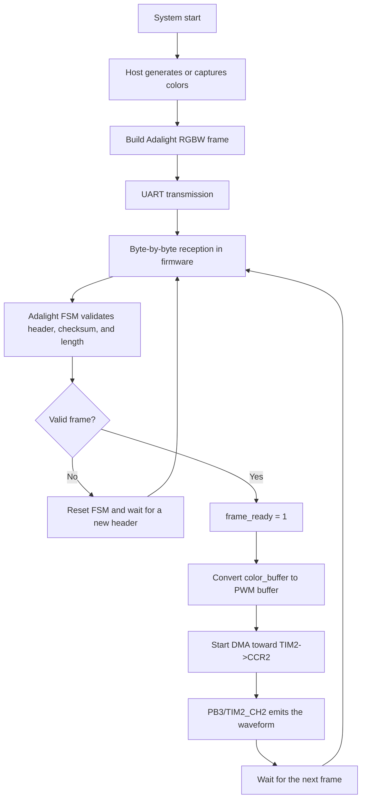
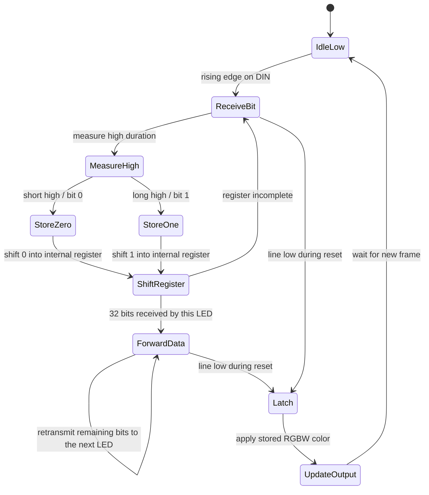
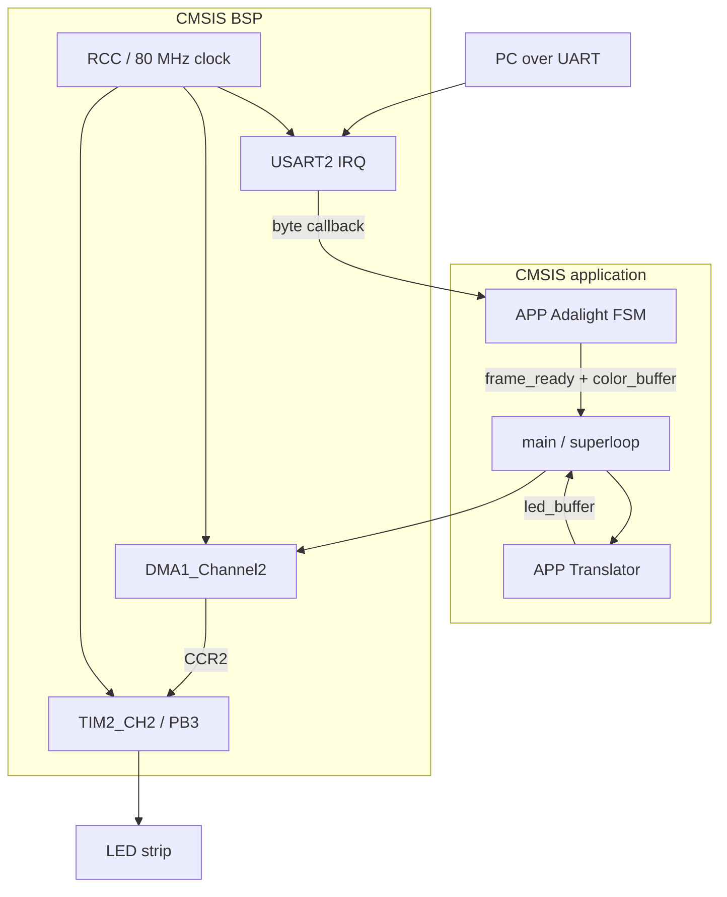
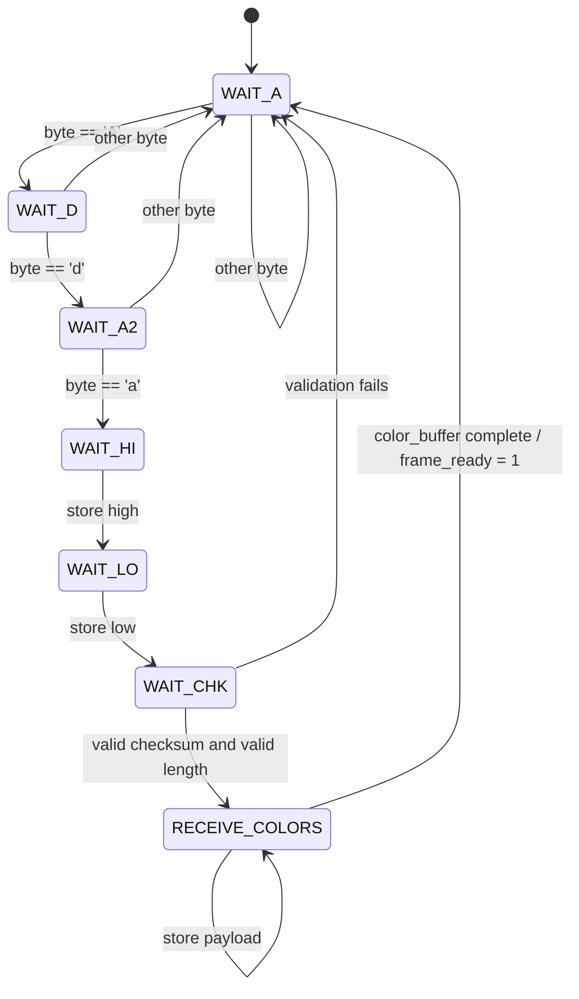
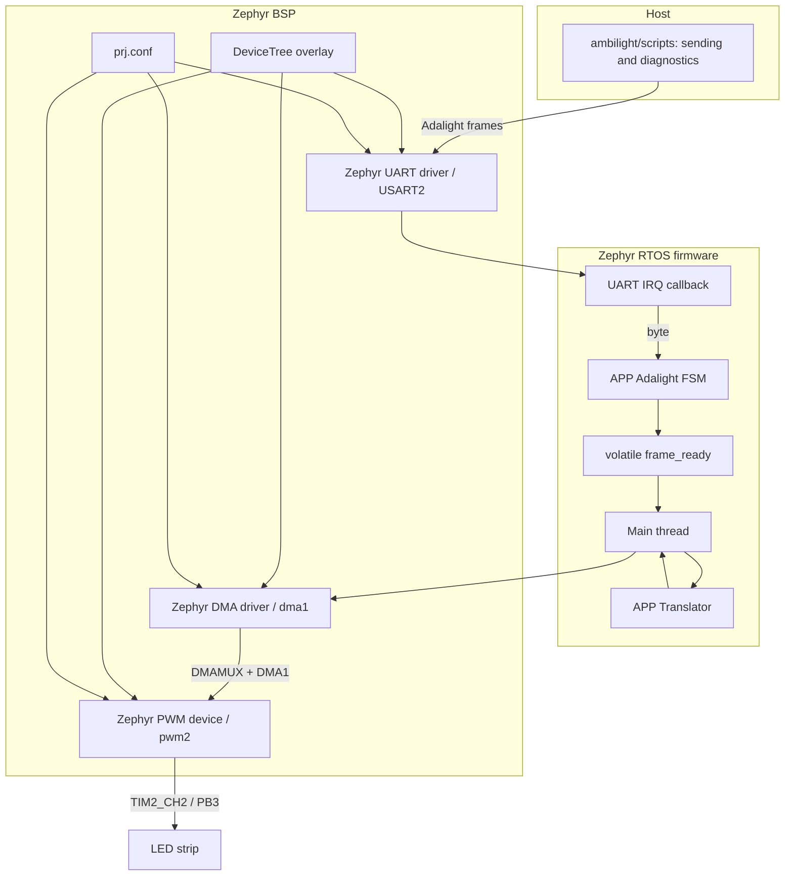
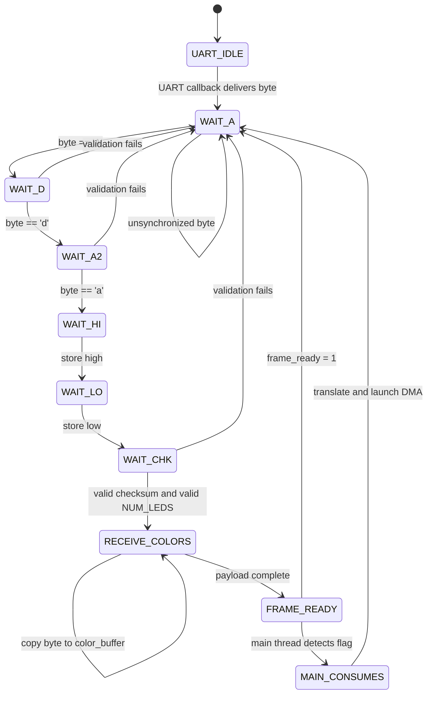
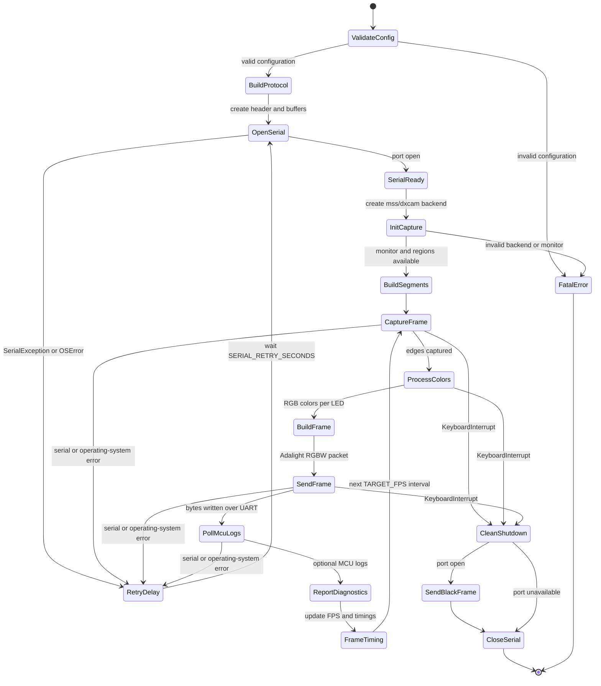

# Technical Documentation for the Ambilight Project

## 1. Introduction

This document describes the Ambilight project as an embedded solution for controlling an RGBW LED strip from data generated on a Host PC. The complete system receives colors over serial communication, validates frames compatible with the Adalight protocol, converts RGBW bytes into PWM samples, and updates the LED output through a timer and DMA.

The project exists in two firmware implementations:

| Implementation | Location | Target MCU | Approach |
|---|---|---|---|
| CMSIS | `C:\Users\justa\OneDrive\Documentos\PlatformIO\Projects\test` | STM32L412KB | Direct register-level control, interrupts, and a superloop. |
| Zephyr RTOS | `C:\Users\justa\OneDrive\Documentos\PlatformIO\Projects\ambilight` | STM32L432KC | Integration with Zephyr drivers, DeviceTree, the main thread, and a compatible BSP. |

Both implementations share the same functional contract: the host sends an `Ada` frame, the firmware receives it byte by byte, an FSM validates the header and size, the color buffer is converted into PWM values, and DMA feeds `TIM2->CCR2` to generate the signal on PB3/TIM2_CH2.

Common functional values:

| Parameter | Value |
|---|---:|
| Active LEDs | 120 |
| Bytes per LED | 4, RGBW format |
| Color payload | 480 bytes |
| PWM samples | 3940 samples, including the reset/latch zone |
| Header | `Ada + high + low + checksum` |
| Checksum | `high ^ low ^ 0x55` |

## 2. General System Architecture

The system is divided into two domains: the host, which generates or captures colors, and the STM32 firmware, which converts those data into a physical signal for the LED strip.


The firmware does not decide the visual content of the LED strip. Its responsibility is to receive a valid frame, preserve byte order, expand each bit into a PWM value, and transmit the waveform with stable timing.

### Communication Protocol

The frame expected by both implementations is:

```text
Byte 0: 'A'
Byte 1: 'd'
Byte 2: 'a'
Byte 3: high = (NUM_LEDS - 1) >> 8
Byte 4: low  = (NUM_LEDS - 1) & 0xFF
Byte 5: checksum = high ^ low ^ 0x55
Bytes 6..485: RGBW payload, 480 bytes
```

The firmware validates the header, checksum, and number of LEDs. The RGBW content is not interpreted semantically inside the firmware; it is processed as a linear byte sequence.

### General Operating Flow



### SK6812 LED Strip Operation

The SK6812 is an addressable LED strip. Each LED contains an internal controller that receives a timed serial sequence on a single data pin, takes the bits assigned to it, and retransmits the remaining bits to the next LED in the chain. In the RGBW configuration used by the project, each LED consumes 32 bits: 8 bits for red, 8 for green, 8 for blue, and 8 for white.

The signal is not UART, SPI, or traditional multichannel PWM. The firmware generates a pulse train where each bit lasts approximately 1.25 us. Within that period, the high-level duration defines the logical value: a short high pulse represents `0`, and a long high pulse represents `1`. For this reason, the timer runs at 80 MHz while the resulting waveform is emitted at 800 kHz: the fast clock is divided into 100 ticks to build each bit with sufficient timing resolution.

In the firmware, the translator converts each RGBW bit into a duty cycle sample. DMA then updates `TIM2->CCR2` once per PWM period, and TIM2_CH2 emits the physical waveform on PB3. After the 3840 bits for the 120 LEDs are complete, the PWM buffer adds a low reset/latch zone so the strip applies the new frame.



This behavior explains why the firmware must preserve the exact bit order and maintain stable timing. If the duty cycle of a bit falls in the short range, the SK6812 interprets it as `0`; if it falls in the long range, it interprets it as `1`. The final low pause does not represent a color, but the latch condition that confirms the frame has ended.

## 3. CMSIS Implementation

### General Description

The CMSIS implementation is the original firmware version. It uses direct access to STM32L412KB registers to configure the clock, UART, timer, GPIO, and DMA. Its architecture is deliberately small: a BSP initializes peripherals, the application layer processes the protocol, and `main` coordinates the transition from a complete frame to PWM output.

Main responsibilities:

| Component | Responsibility |
|---|---|
| `main` | Initialize the BSP, register the UART callback, monitor `frame_ready`, and trigger conversion/DMA. |
| BSP UART | Configure USART2, communication pins, and the receive interrupt. |
| BSP PWM/RCC | Configure the system clock, GPIO PB3, and TIM2_CH2. |
| BSP DMA | Prepare DMA1 to write PWM samples into `TIM2->CCR2`. |
| APP Adalight | Implement the receive FSM and fill `color_buffer`. |
| APP Translator | Convert RGBW bytes into PWM samples bit by bit. |

### CMSIS Architecture



The system uses a superloop without a scheduler. The only relevant asynchronous path is the USART2 interrupt, which delivers bytes to the parser through a callback. The remaining processing runs when the superloop detects `frame_ready`.

### System Initialization

The startup order is:

1. Clock and Flash latency configuration through `rcc_init`.
2. USART2, pin, and `USART2_IRQHandler` configuration through `uart_init`.
3. PB3 configuration as alternate function TIM2_CH2 through `pwm_init`.
4. DMA1 configuration for memory-to-peripheral transfer through `dma_init`.
5. Registration of `Adalight_ProcessByte` as the UART receive callback.

This sequence keeps peripheral initialization separate from application logic.

### CMSIS FSM



The FSM can recover synchronization by discarding incomplete or invalid frames until it finds a new `Ada` header.

### CMSIS Workflow

1. **Data reception:** `USART2_IRQHandler` reads the received byte and executes the registered callback.
2. **Internal processing:** `Adalight_ProcessByte` advances the FSM and copies color bytes into the linear buffer.
3. **LED update:** when `frame_ready` is set, the superloop converts the RGBW buffer into PWM samples.
4. **Physical transfer:** DMA1 writes the samples into `TIM2->CCR2`, updating the TIM2_CH2 duty cycle on PB3.
5. **Error handling:** header, checksum, or length errors reset the FSM to `WAIT_A`.
6. **Main loop:** the superloop waits for new frames, without queues or multitasking.

### Technical Characteristics

The CMSIS implementation minimizes abstraction layers and allows fine-grained register-level control. This favors timing predictability and low overhead, but concentrates responsibility for safety, synchronization, and maintenance on the programmer. DMA triggering occurs from the application, so the boundary between the BSP and coordination logic is less strict than in the Zephyr version.

## 4. Zephyr RTOS Implementation

### General Description

The Zephyr implementation is an evolution of the CMSIS version. It preserves the application contract, the Adalight parser, and the RGBW-to-PWM translation, but moves hardware integration to Zephyr mechanisms: DeviceTree, UART/PWM/DMA drivers, `prj.conf` configuration, and a compatible BSP.

Migration motivations:

- Reduce direct dependence on manual clock and pinmux initialization.
- Use Zephyr drivers and declarative configuration.
- Improve BSP portability and maintainability.
- Make diagnostics and tests easier through separate environments.
- Prepare the project for future growth with RTOS primitives if required.

The current architecture does not create additional application threads. The main flow runs in the Zephyr main thread; UART reception enters through an interrupt-driven callback, and synchronization with the main thread is performed with `volatile frame_ready`.

### Zephyr Architecture



The diagram shows the separation between application and BSP. Zephyr provides the device model and driver support; the functional protocol logic remains in application modules equivalent to the CMSIS firmware modules.

### Scheduling, Synchronization, and Drivers

| Element | Current use in Zephyr |
|---|---|
| Main thread | Runs initialization, the operational superloop, translation, and DMA triggering. |
| UART callback | Delivers bytes received from USART2 to the Adalight parser. |
| Synchronization | `volatile frame_ready`, shared between callback and main thread. |
| DeviceTree | Enables USART2, DMA1, TIM2/PWM2, and pin PB3 as AF1. |
| `prj.conf` | Enables `CONFIG_SERIAL`, `CONFIG_UART_INTERRUPT_DRIVEN`, `CONFIG_DMA`, `CONFIG_PWM`. |
| PWM | Uses TIM2_CH2 on PB3 as the physical output. |
| DMA | Uses DMA1/DMAMUX to feed `TIM2->CCR2` from the PWM buffer. |

Queues and worker threads are not documented as part of the current implementation. Zephyr allows them to be added in a later evolution, but the current state preserves a flow close to the original superloop to reduce migration risk.

### Zephyr FSM



The protocol FSM is equivalent to CMSIS. The architectural difference is the byte source: in CMSIS it comes from `USART2_IRQHandler`; in Zephyr it comes from the callback registered on the UART driver.

### Zephyr Workflow

1. **Data capture and reception:** tools under `ambilight/scripts/` generate RGBW frames and send them over USART2.
2. **Task distribution:** the Zephyr UART driver invokes the receive callback; the main thread watches `frame_ready`.
3. **Processing:** the parser fills `color_buffer`; the translator expands bits into PWM values.
4. **LED update:** the BSP starts a DMA transfer toward `TIM2->CCR2` to modulate PB3/TIM2_CH2.
5. **Error handling:** the FSM discards invalid frames; initialization or DMA errors are exposed through return values and temporary diagnostics.
6. **Operating loop:** the main thread repeats the receive-frame, translate, transmit, wait-for-new-frame cycle.

### Evolution Compared with CMSIS

The Zephyr version preserves the functional architecture to maintain compatibility, but improves the abstraction boundary. The application no longer needs to write directly to DMA registers to start a transfer; it uses a dedicated BSP function. Pin and device configuration is also represented in DeviceTree, making the relationship between firmware and hardware more explicit.

## 5. Scripts and Auxiliary Tools

The documented scripts belong to the directory `C:\Users\justa\OneDrive\Documentos\PlatformIO\Projects\ambilight\scripts`. Their function is to operate from the host: generate Adalight RGBW frames, send data over UART, read firmware diagnostics, and validate the visible behavior of the LED strip. They are not part of the STM32 firmware, but they are the necessary counterpart for exercising the protocol and measuring the complete system.

### Rationale for Custom Tools

Before developing the Python tools, existing Ambilight solutions such as Prismatik and Hyperion were tested. Although these applications provide a more complete interface and, under normal conditions, can deliver higher and more stable refresh rates than a custom script, the first tests with the LED strip were not satisfactory. The strip mainly showed persistent white tones while also attempting to show colors that did not correctly correspond to the screen content. Visible flicker was also observed, making it difficult to separate whether the issue came from the firmware, the protocol, the color order, the host program configuration, or the physical output itself.

Given that behavior, the first test script `adalight_sim.py` was more useful for validating the system base: it generated simple frames with pure colors and made it possible to directly verify whether the `UART -> parser -> translator -> PWM/DMA -> SK6812` path responded correctly. That difference led to prioritizing a manual Python solution, where the frame format, RGBW order, send rate, patterns, and diagnostics could be controlled explicitly during the firmware migration.

The disadvantage of this decision is that the custom script does not have the same level of optimization or timing stability as a dedicated solution. In early tests, screen capture with `mss`, NumPy processing, serial transmission, and general operating-system load mainly competed for CPU time, which could reduce the frame rate when screen content was complex. To improve this point, the main capture backend was migrated to `dxcam`, using the dedicated RTX 4050 GPU as the capture device. This change offloads an important part of the capture work from the traditional CPU path and enables a much more stable rate, reaching 60 FPS in the current configuration. Even so, performance can vary depending on the capture backend, selected monitor, PC activity, GPU load, and amount of information processed per frame. In practice, the script provides more observability and control for development, but its timing stability still depends on the host and selected capture path.

### Python Dependencies

The `scripts/requirements.txt` file declares the dependencies required for the host tools:

| Dependency | Use within the project |
|---|---|
| `pyserial` | Opening the COM port, sending Adalight frames, and reading firmware logs. |
| `numpy` | Vectorized processing of colors, RGBW buffers, and filters in the main Ambilight script. |
| `mss` | Portable screen capture used by default. |
| `dxcam` | Optional Windows backend for higher-performance capture. |

The serial port configuration must match the firmware. In the current state, the main scripts use `COM6` and `921600` baud as default values. If the port changes, it must be adjusted in the script configuration or through arguments when the script supports them.

### Available Tools

| Tool | Purpose | Expected input | Expected output | Relationship with firmware/hardware |
|---|---|---|---|---|
| `adalight_stable_rgbw.py` | Public entry point for the Ambilight system on the PC. | Captured screen, monitor configuration, available serial port. | Adalight RGBW frames sent continuously over UART. | Feeds the firmware parser with real frames derived from the screen. |
| `adalight_stable_rgbw/` | Modular package used by the main entry point. | Internal configuration and data captured by the backend. | Captures, filtered colors, serial packets, and diagnostics. | Keeps the `Ada + RGBW payload` contract expected by STM32 compatible. |
| `ambilight_estable_rgbw.py` | Compatibility wrapper for the previous name. | The same parameters as the new entry point. | Executes the same flow as `adalight_stable_rgbw.py`. | Preserves old commands without duplicating logic. |
| `adalight_sim.py` | Simple simulator for uniform Adalight frames. | Available COM port; generates random RGB colors internally. | Uniform RGBW frames with `W = 0`, sent every 0.5 s. | Tests UART reception, the Adalight FSM, and LED output without screen capture. |
| `adalight_diagnostic_patterns.py` | Diagnostic tool with deterministic patterns and MCU log reading. | CLI arguments for port, baud rate, FPS, mode, and frame count. | Serial patterns, `[MCU]` logs, and PASS/WARN counter summary. | Validates that the firmware receives bytes, accepts frames, and triggers PWM/DMA. |
| `requirements.txt` | Declaration of Python environment dependencies. | Installation with `pip`. | Reproducible environment for running host tools. | Reduces test failures caused by missing dependencies. |

### Main Ambilight Script

The `adalight_stable_rgbw.py` script does not contain the logic directly; it delegates to `adalight_stable_rgbw.runner.main()`. This decision keeps the entry point simple and concentrates the implementation in specialized modules.

The operating flow of the main script is:

1. **Configuration validation:** `config.validate_config()` checks parameters such as number of LEDs, bytes per LED, brightness, smoothing, capture backend, capture mode, and target FPS.
2. **Protocol preparation:** `protocol.build_adalight_header()` builds the `Ada + high + low + checksum` header for `TOTAL_LEDS = 120`; `AdalightFrameBuilder` reserves and reuses buffers to avoid per-frame allocations.
3. **Serial connection:** `open_serial()` opens the configured port with `pyserial`, applies read/write timeouts, and briefly waits for the link to become ready.
4. **Screen capture:** `capture.create_capture_backend()` selects `mss` or `dxcam`. The `edges` mode captures only perimeter bands; the `single` mode captures the full monitor and crops the edges.
5. **Segmentation:** `processing.build_edge_segments()` divides each edge into segments associated with physical LEDs. The current distribution uses `LEDS_BOTTOM = 53`, `LEDS_RIGHT = 22`, `LEDS_TOP = 45`, and `LEDS_LEFT = 0`.
6. **Color processing:** `process_edges()` calculates a robust color for each segment, applies luminance clipping, saturation boost, gamma, brightness, deadband, differentiated rise/fall smoothing, and maximum per-frame change limiting.
7. **Physical order:** `physical_led_order()` concatenates colors as bottom, reversed right, reversed top, and left. This adapts screen sampling to the physical path of the LED strip.
8. **UART send:** `send_adalight_frame()` generates the RGBW packet with channel `W = 0` and writes it to the serial port. The firmware receives the frame and translates it to PWM/DMA.
9. **Timing:** the loop uses `TARGET_FPS` to calculate the interval between frames. If capture, processing, or transmission take longer than the interval, the next frame is scheduled from the current time to avoid accumulated delay.
10. **Diagnostics and shutdown:** `Diagnostics` reports FPS, capture time, processing time, transmission time, and bytes per frame. `McuLogReader` can print logs received from the STM32. On `KeyboardInterrupt`, the script attempts to send a black frame before closing the port.

The following diagram summarizes the state behavior of the main program. The normal flow remains in the capture, processing, and send loop; serial errors lead to a reconnection wait, and manual interruption performs a clean LED strip shutdown.



The main input of the script is the visual content of the selected monitor. The output is a sequence of 486-byte Adalight RGBW frames: 6 header bytes and 480 payload bytes. The firmware does not receive information about regions, monitors, or filters; it only receives already ordered RGBW bytes.
### Momentary Brightness Flicker in `adalight_stable_rgbw.py`

During execution of the main program, momentary flickers can appear where the general color of the LED strip is preserved, but brightness changes briefly. This behavior is usually associated with the host side of the system, not necessarily with the STM32 firmware. The firmware only reproduces the last valid frame received: if the host delivers frames with small global luminance variations, the strip reflects them as intensity changes.

The most likely causes are:

- **Capture variation:** the capture backend can take frames at different moments in the operating system rendering cycle, especially during fast-moving scenes, overlays, GPU-accelerated video, or abrupt brightness changes.
- **Segment averaging:** processing calculates representative colors per zone. If a region contains flashes, subtitles, high-contrast edges, or scene changes, the average can vary even if the dominant hue appears stable.
- **Host timing:** if capture, processing, or serial writes exceed the target interval, the program resynchronizes the next frame. This correction avoids accumulated delay, but can produce perceptible intensity differences between consecutive frames.
- **Visual filters:** deadband, smoothing, and maximum change limiting reduce abrupt jumps, but do not completely eliminate small luminance variations. Therefore, flicker can appear as a brief brightness change without altering the main color.

In diagnostic terms, if the logic analyzer continues showing valid PWM pulses and the firmware continues accepting frames, flicker should first be investigated in capture, color processing, and script timing stability before attributing it to UART, parser, DMA, or TIM2.

### Internal Modules of the Main Package

| Module | Technical responsibility |
|---|---|
| `config.py` | Defines port, baud rate, LED distribution, capture parameters, color calibration, smoothing, FPS, and diagnostics. It also validates configuration consistency before startup. |
| `capture.py` | Implements `MssCapture` and `DxcamCapture` backends, monitor detection/listing, absolute geometry, and perimeter regions. |
| `processing.py` | Converts RGB captures into per-LED colors through segmentation, sampling, visual filters, and the physical order of the LED strip. |
| `protocol.py` | Builds Adalight headers, RGBW payload, complete frame, serial opening, and black shutdown frame. |
| `diagnostics.py` | Accumulates time/byte metrics, reports FPS, and reads diagnostic lines emitted by the firmware without blocking the main loop. |
| `runner.py` | Orchestrates validation, serial connection, capture, processing, sending, timing, reconnection, and clean shutdown. |

### Test and Diagnostic Scripts

`adalight_sim.py` is a basic test for communication and LED output. It opens the serial port, builds the Adalight header for 120 LEDs, and sends frames where all LEDs share a random RGB color with white turned off. Its only external input is the available COM port; the pattern is generated internally. Its expected output is a sequence of visible color changes on the LED strip. It is useful for ruling out screen capture or processing issues because it directly tests `UART -> FSM Adalight -> color_buffer -> Translator -> PWM/DMA`.

`adalight_diagnostic_patterns.py` is a more controlled validation tool. It accepts arguments such as `--port`, `--baud`, `--frames`, `--fps`, `--mode`, `--boot-wait`, and `--final-wait`. The available modes are `sequence`, `blocks`, `scanner`, and `rainbow`. In addition to sending frames, it opens a background reader that prints firmware lines with the `[MCU]` prefix and extracts counters such as `rx_bytes`, `parsed_frames`, and `frame_ready` when they appear in logs. At the end, it compares the initial and final counters to emit `PASS` or `WARN` messages.

This second tool is especially useful during tests with diagnostic firmware because it allows a single serial port to send data and read reception evidence. If bytes transmitted by the host increase but `rx_bytes` or `parsed_frames` do not increase in the firmware, the issue is before PWM translation. If frames are accepted but there is no output on PB3, focus moves to the `Translator -> DMA -> TIM2->CCR2 -> TIM2_CH2` path.

### Relationship with System Validation

The Python tools cover different levels of testing. The main script validates real Ambilight behavior with screen capture and sustained refresh rate. The simple simulator reduces the system to uniform frames to verify communication and visible output. Pattern diagnostics add observability by reading firmware counters and make it possible to separate UART, parser, processing, and PWM/DMA failures.

Together, these tools allow validation of the complete system without modifying the stable firmware: the host generates frames compatible with Adalight, the STM32 confirms reception and processing, and the SK6812 LED strip physically shows whether the PWM/DMA waveform is correct.

## 6. System Performance

Overall performance depends on three segments: generation/capture on the PC, UART transmission, and PWM output toward the LED strip.

### Serial Communication

Each complete frame for 120 RGBW LEDs contains 486 bytes: 6 header bytes and 480 payload bytes. At 921600 baud, assuming 8N1 serial format, the theoretical transmission time is approximately:

```text
486 bytes * 10 bits/byte / 921600 bit/s = 5.27 ms per frame
```

This leaves margin for 30 FPS and 60 FPS update rates from the perspective of the serial link. At 144 FPS, the link remains feasible in raw terms, but the margin is reduced by capture, processing, host timing, and firmware reception tolerance.

### PWM Output

The PWM buffer contains 3940 samples. With a timing of 1.25 us per sample, the physical output of one frame occupies approximately:

```text
3940 * 1.25 us = 4.925 ms
```

This time is comparable to UART transmission time at 921600 baud. Therefore, the system must avoid blocking reception or overlapping transfers in an uncontrolled way when the frame rate increases.

### CMSIS versus Zephyr

CMSIS reduces overhead and allows each register to be adjusted directly. Zephyr introduces a driver and configuration layer, but improves traceability, portability, and organization. In the current implementation, RTOS cost is low because multiple application threads are not used; the main thread preserves a structure similar to the original superloop.

## 7. CMSIS vs Zephyr Comparison

| Aspect | CMSIS | Zephyr |
|---|---|---|
| Complexity | Low in layers, high in register-level detail. | Higher because of RTOS, DeviceTree, and drivers. |
| Scalability | Limited as concurrent tasks grow. | Better prepared for threads, synchronization, and new peripherals. |
| Maintainability | Depends heavily on MCU knowledge. | Better separation between application, BSP, and hardware configuration. |
| Development time | Fast for focused hardware tests. | Higher initial startup cost, lower extension cost. |
| Modularity | Partial: APP/BSP, but with direct accesses from `main`. | Higher: BSP encapsulates adapters and uses Zephyr drivers. |
| Resource usage | Lower firmware overhead. | Higher base consumption because of the kernel and drivers. |
| Performance | Very predictable if the code is carefully controlled. | Sufficient for the current application, with overhead offset by better abstractions. |
| Debugging | Direct but manual; requires register inspection. | Better integration with logs, configuration, and tests by environment. |

### CMSIS Strengths

CMSIS is suitable when fine-grained control, small firmware, and timing behavior that is easy to reason about at the register level are required. It is especially useful for initial peripheral validation, timing tests, and projects where the number of concurrent tasks is low.

### CMSIS Weaknesses

The main limitation is scalability. As peripherals, diagnostics, protocols, or simultaneous tasks increase, the superloop and manual interrupts become more difficult to maintain. The risk of errors from register configuration, race conditions, and coupling between application and BSP also increases.

### Zephyr Strengths

Zephyr provides a more robust structure for projects that evolve. DeviceTree documents the hardware-firmware relationship, drivers reduce repetitive configuration, and the kernel allows threads, queues, timers, and synchronization to be introduced when needed. In this project, Zephyr preserves the functional logic while improving BSP organization.

### Zephyr Weaknesses

Zephyr adds memory overhead, build system overhead, configuration overhead, and a learning curve. It can also make debugging harder when RTOS drivers are mixed with direct register accesses. For very specific functions such as PWM streaming through DMA, a carefully delimited direct BSP adapter may be necessary.

## 8. Conclusions

Ambilight behaves as a single functional solution with two firmware implementations that are equivalent in contract but different in implementation strategy. CMSIS represents the direct-control, low-overhead foundation; Zephyr represents an evolution focused on maintainability, declarative configuration, and system growth.

The most important conceptual separation is common to both versions:

```text
UART -> FSM Adalight -> color_buffer -> Translator -> PWM buffer -> DMA/TIM2 -> PB3 -> LED strip
```

As long as this contract is preserved, both implementations can be compared, validated, and evolved without changing the external protocol or the behavior expected by the host tools.

