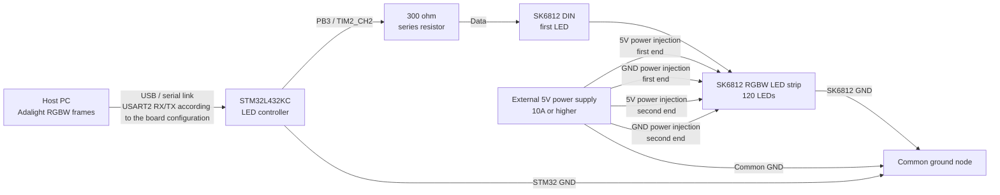

# Wiring Guide

## Overview

The host PC sends Adalight RGBW frames to the STM32L432KC over the serial link. The STM32 receives those frames and generates the SK6812 single-wire waveform from `PB3 / TIM2_CH2`. The SK6812 RGBW LED strip is powered by an external 5V supply; the STM32 board does not power the LED strip.

## Wiring Table

| From | To | Notes |
| --- | --- | --- |
| External PSU 5V | SK6812 5V input, first end | Use the external 5V power supply, not the STM32 board. |
| External PSU GND | SK6812 GND input, first end | Must share the same ground as the STM32. |
| External PSU 5V | SK6812 5V input, second end | Inject power at the far end to reduce voltage drop. |
| External PSU GND | SK6812 GND input, second end | Use the same external supply ground. |
| External PSU GND | STM32 GND | Required common reference for the data signal. |
| STM32 PB3 / TIM2_CH2 | 300 ohm series resistor -> SK6812 DIN | Place the resistor in series on the data line. |
| PC USB / serial link | STM32 UART / virtual COM port | Use USART2 RX/TX according to the board configuration. |

## Power Notes

Use an external 5V power supply rated for at least 10A. A higher current rating is preferred if the LED strip may run at high brightness or near full white.

Do not power the LED strip from the STM32 board. The STM32 board is only the controller and serial endpoint; the LED strip current must come from the external power supply.

Inject 5V and GND at both ends of the LED strip. Power injection at both ends reduces voltage drop along the 120-LED strip and helps keep color and brightness more consistent.

The external power supply GND, SK6812 GND, and STM32 GND must be connected together. This common ground is required so the SK6812 DIN input has the same reference as the STM32 data output.

## Signal Notes

`PB3 / TIM2_CH2` is the SK6812 data output from the STM32.

The `300 ohm` series resistor should be placed close to the STM32 data pin if possible. It must be in series between `PB3 / TIM2_CH2` and the LED strip `DIN` input.

The firmware generates an 800 kHz single-wire waveform using TIM2 and DMA. This waveform is not a UART data signal; UART is only used between the Host PC and the STM32.

Connect the STM32 data line to the `DIN` side of the LED strip, not `DOUT`. `DOUT` is the forwarded data output from one LED to the next LED.

## Safety Checklist

- [ ] External supply set to 5V before connecting LEDs.
- [ ] Supply current rating is adequate.
- [ ] GND is common between PSU, LED strip, and STM32.
- [ ] Data line goes through the 300 ohm resistor.
- [ ] Data is connected to DIN.
- [ ] LED strip is not powered from the STM32.
- [ ] Polarity checked before power-up.
